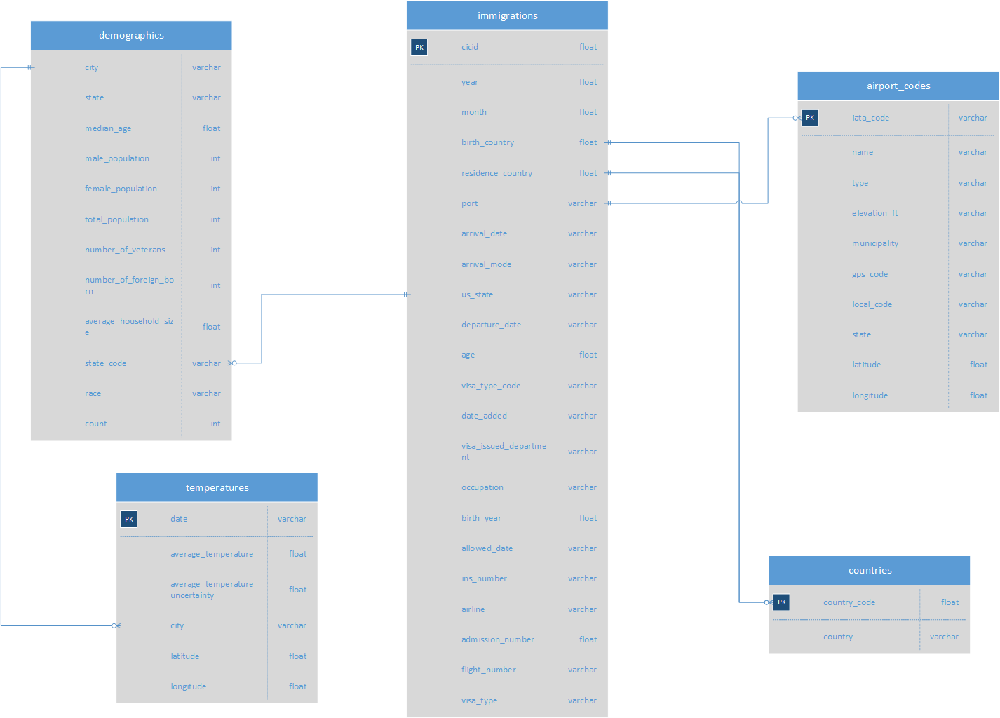

# Data Engineering Capstone Project

#### Project Summary
This project recaps the knowledge that I have gained during the Udacity Data Engineering NanoDegree Program and follows the steps below:

* Step 1: Scope the Project and Gather Data
* Step 2: Explore and Assess the Data
* Step 3: Define the Data Model
* Step 4: Run ETL to Model the Data
* Step 5: Complete Project Write Up

#### Scope 
In this project the US I94 immigration data are explored, enriched and connected with demographics, airport and temperature data for better analysis. The source of data are files and using Pandas and Spark dataframes we are cleaning and transforming, producing the output tables as parquet files.

#### I94 Immigration Data

This data comes from the US National Tourism and Trade Office. A data dictionary is included in the workspace. This is where the data comes from. There's a sample file so you can take a look at the data in csv format before reading it all in.

####  Conceptual Data Model
The conceptual data model that I designed, contains the Immigrations fact table with direct relations to the airport, countries and demographics which are the dimensions tables. For further analysis of the temperatures data there is a direct relationship to the demographics table.

I have chosen the star schema, because the queries will focus on analysing the immigration data. Some examples of analytics queries on the current data model would be: 
* From which countries do immigrants mostly come from?
* What are the types of airports that they use mostly?
* What is the total population of the state they arrive to?
* What is the average temperature for the most visited locations?

#### Clearly state the rationale for the choice of tools and technologies for the project.

I have worked using the Pandas and Spark dataframes depending on the volumes and the complexity of the data.
In some cases, it's easier to use Pandas dataframes to perform cleaning / transformation of the data. When it comes to fast processing and Apache Spark dataframes is the best way to go. In addition, Spark gives the flexibility to handle different file formats (SAS) and perform standatd SQL queries on the tables (after creating Temporary Views on them).
Defining the Schema is also a plus for the Apache Spark choice of working. The output files are parquet format, allowing us to partition and upload large datasets to a cloud solution.

#### Propose how often the data should be updated and why.

The demographics data should be updated once a year. Immigration data, temperatures and airport codes should be updated once a month based on their lifecycle nature. In case they need to be updated more often, this should happen on a daily basis. Countries and other reference data can be updated rarely.

#### Write a description of how you would approach the problem differently under the following scenarios:

#### The data was increased by 100x.
If the project is heavy on reading over writing, I would store the data in AWS Redshift clusters, increasing the number of nodes and processing power.
The solution is already implemented in Spark, so in the case of heavy writing I would use EMR (or a similar distributed cloud solution) to store the data into HDFS with Spark distribution.

#### The data populates a dashboard that must be updated on a daily basis by 7am every day.
The ETL steps can be implemented as DAG steps in Apache Airflow or a similar product. In that case we can choose which of the datasets should be updated daily and which of them less often.
The DAG would be scheduled to run at 7am every day. In case of DAG failure, the Dashboard is not updated and a notification/email is sent to the affected teams/individuals.

#### The database needed to be accessed by 100+ people
A proven cloud solution like a DWH (Redshift) can be used so that the data can be consumed by a large number of people. However, considering the amount of queries and the availability in the day we can also run specific queries and store the results in S3 for quick access and consumption by the BI and Analytics apps.
